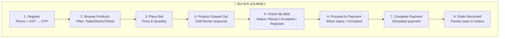
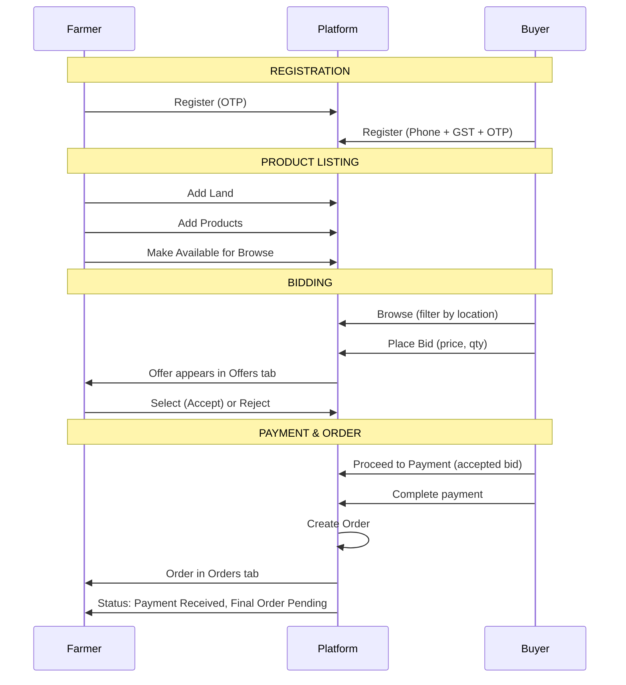
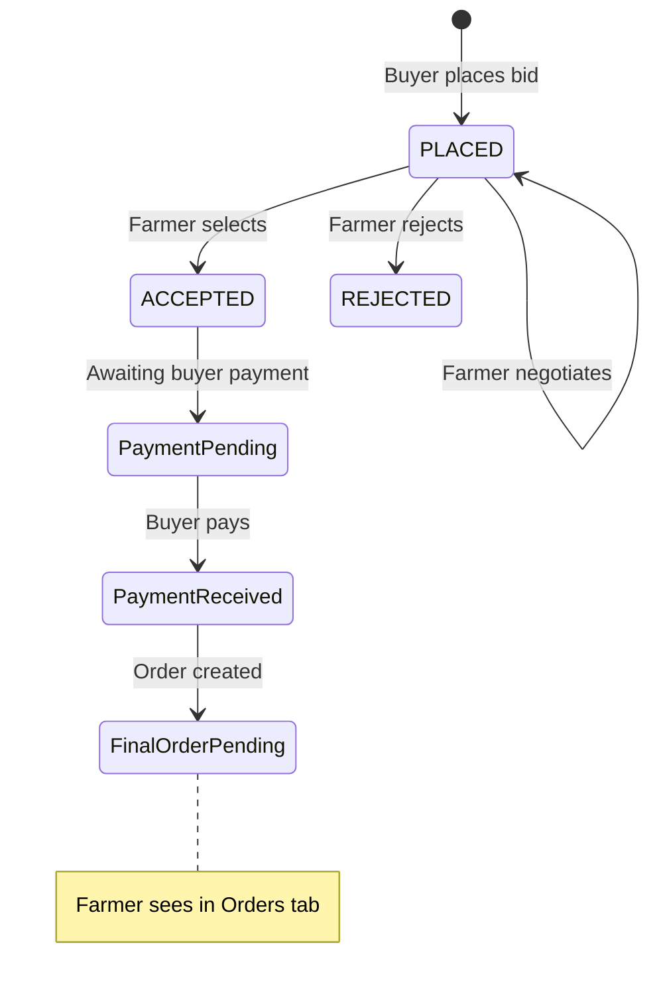

# Agricultural Platform — End-to-End User Flow (Demo Guide)

**Purpose:** Visual documentation for demos to wider audiences. Shows the complete journey of Farmer and Buyer on the platform.

---

## 1. Overview — How Farmer & Buyer Connect

```
┌─────────────────────────────────────────────────────────────────────────────────┐
│                     AGRICULTURAL PLATFORM — CORE FLOW                            │
├─────────────────────────────────────────────────────────────────────────────────┤
│                                                                                 │
│   FARMER                                      PLATFORM                    BUYER  │
│   ──────                                      ────────                    ─────  │
│                                                                                 │
│   Register ──────────►  (OTP)  ◄────────────── Login ──────────►  Register      │
│   Add Land ──────────►  (Khasra)                                     │          │
│   Add Products ──────►  (Browse available)                           │          │
│         │                     │                                       │          │
│         │                     │◄──────── Browse ──────────────────────┘          │
│         │                     │         Filter by State/District/Tehsil          │
│         │                     │                                                   │
│         │◄──── Offers ────────┤◄──────── Place Bid (Price, Qty)                  │
│   Select/Reject ─────►  (Bid status)                                              │
│         │                     │         Products grayed while bid pending        │
│   Accept Offer ──────►  (ACCEPTED)                                                │
│         │                     │                                                   │
│         │                     │◄──────── Proceed to Payment ───────►  Pay        │
│         │                     │         (Simulated payment recorded)             │
│         │                     │                                                   │
│   Payment Received ◄───  Order Created                                            │
│   Orders Tab ◄──────►  Final Order Pending                                        │
│                                                                                 │
└─────────────────────────────────────────────────────────────────────────────────┘
```

---

## 2. Farmer Journey — Step-by-Step

```mermaid
flowchart TB
    subgraph Farmer["👨‍🌾 FARMER JOURNEY"]
        F1[1. Register<br/>Phone → OTP → Details]
        F2[2. Add Land<br/>Khasra, village, district]
        F3[3. Add Products<br/>Name, category, quantity, price]
        F4[4. Make Available for Browse<br/>Toggle products]
        F5[5. Receive Offers<br/>Offers tab]
        F6[6. Select or Reject<br/>Accept / Reject / Negotiate]
        F7[7. Await Payment<br/>Payment Pending status]
        F8[8. See Payment Received<br/>Status updates]
        F9[9. View Order<br/>Orders tab: Final Order Pending]
        
        F1 --> F2 --> F3 --> F4 --> F5 --> F6 --> F7 --> F8 --> F9
    end
```



### Farmer Demo Talking Points

| Step | Screen | What to Show |
|------|--------|--------------|
| 1 | Login → Farmer → Register | OTP-based registration; phone verification |
| 2 | Dashboard → Profile → Lands | Add land with Khasra number, village, district |
| 3 | Products | Add product (name, category, quantity, price); link to land |
| 4 | Products | Toggle "Available for Browse" so buyers can see |
| 5 | **Offers** | Incoming bids from buyers (Price, Qty, Buyer name) |
| 6 | Offers | **Select** to accept or **Reject**; optional **Negotiate** |
| 7 | Offers | After accept: status shows "Payment Pending" |
| 8 | Offers | After buyer pays: status shows "Payment Received" |
| 9 | **Orders** | Order appears with "Final Order Pending" and "Payment Received" |

---

## 3. Buyer Journey — Step-by-Step



### Buyer Demo Talking Points

| Step | Screen | What to Show |
|------|--------|--------------|
| 1 | Login → Buyer → Register | Phone + GST required; OTP verification |
| 2 | **Browse** | Farmers & products; Location filter (Country → State → District → Tehsil) |
| 3 | Browse | **Place Bid** — enter price and quantity |
| 4 | Browse | After bid: product card grayed out; "Bid Placed" with time remaining |
| 5 | **My Bids** | Table of all bids: Farmer, Product, Qty, Price, Status |
| 6 | My Bids | **Proceed to Payment** button (only for Accepted bids) |
| 7 | Payment Page | Order summary; Simulate payment; Secure reference stored |
| 8 | — | Farmer sees "Payment Received" and order in Orders tab |

---

## 4. Combined Interaction Flow (Farmer ↔ Buyer)



---

## 5. Dashboard Navigation Map

### Farmer Dashboard Sections

```
┌─────────────────────────────────────────────────────────────────┐
│  FARMER DASHBOARD                                                │
├─────────────────────────────────────────────────────────────────┤
│  🏠 Home          │  Landing, quick actions                      │
│  👤 Profile       │  Personal info, lands                        │
│  🌱 Products      │  Add/edit products, availability             │
│  💰 Offers        │  Incoming bids → Select/Reject               │
│  🔍 Browse Suppliers │  Find machinery/transport                 │
│  🚜 Farming Machinery │  (future)                                │
│  🚚 Transport     │  (future)                                    │
│  📦 Orders        │  Final orders after payment                  │
│  🧪 Quality Test Results │  (future)                             │
└─────────────────────────────────────────────────────────────────┘
```

### Buyer Dashboard Sections

```
┌─────────────────────────────────────────────────────────────────┐
│  BUYER DASHBOARD                                                 │
├─────────────────────────────────────────────────────────────────┤
│  🏠 Home          │  Landing, quick actions                      │
│  👤 Profile       │  Business details                            │
│  🔍 Browse        │  Farmers & products, Place Bid               │
│  💰 My Bids       │  All bids, Proceed to Payment                │
│  📦 Orders        │  Order history                               │
└─────────────────────────────────────────────────────────────────┘
```

---

## 6. Status Flow Diagram



---

## 7. Demo Script (5-Minute Version)

### Minute 1 — Farmer Setup
1. **Login** as Farmer (or Register new farmer)
2. **Profile** → Add a land (Khasra, village, district)
3. **Products** → Add product (e.g. Wheat, 100 kg, ₹25/kg)
4. **Toggle** "Available for Browse"

### Minute 2 — Buyer Browse & Bid
1. **Logout** → Login as Buyer
2. **Browse** → Show location filter (State, District, Tehsil)
3. Find the farmer’s product → **Place Bid** (₹24, 50 kg)
4. Show product grayed out and "Bid Placed"

### Minute 3 — Farmer Responds
1. **Logout** → Login as Farmer
2. **Offers** → See buyer’s bid
3. **Select** to accept
4. Show "Payment Pending" status

### Minute 4 — Buyer Pays
1. **Logout** → Login as Buyer
2. **My Bids** → Find accepted bid
3. **Proceed to Payment**
4. Complete simulated payment

### Minute 5 — Farmer Sees Order
1. **Logout** → Login as Farmer
2. **Offers** → Show "Payment Received"
3. **Orders** → Show order with "Final Order Pending"

---

## 8. Exporting Diagrams for Slides

The Mermaid diagrams in this document can be:

1. **GitHub / GitLab** — Rendered automatically in Markdown
2. **Mermaid Live Editor** — Copy diagram code to https://mermaid.live and export as PNG/SVG
3. **VS Code** — Use "Markdown Preview Mermaid Support" extension
4. **Cursor** — Preview Markdown to see diagrams

---

## 9. Key Messages for Audiences

| Audience | Key Message |
|----------|-------------|
| **Farmers** | List products, receive offers, accept/reject, get paid — all from one dashboard |
| **Buyers** | Browse by location, place bids, pay securely — integrated flow |
| **Investors** | OTP auth, location filters, payment references, orders — production-ready flow |
| **Stakeholders** | End-to-end traceability: Bid → Accept → Pay → Order |

---

*Document version: 1.0 | Last updated: Jan 2025*
